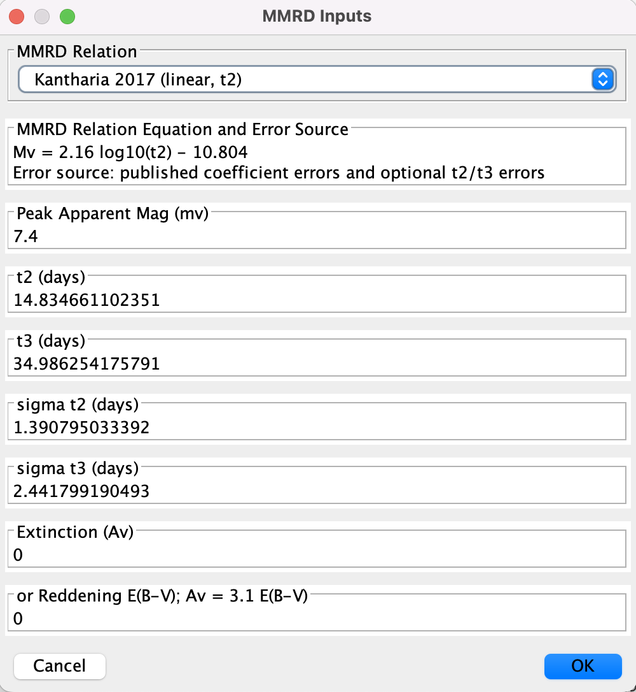
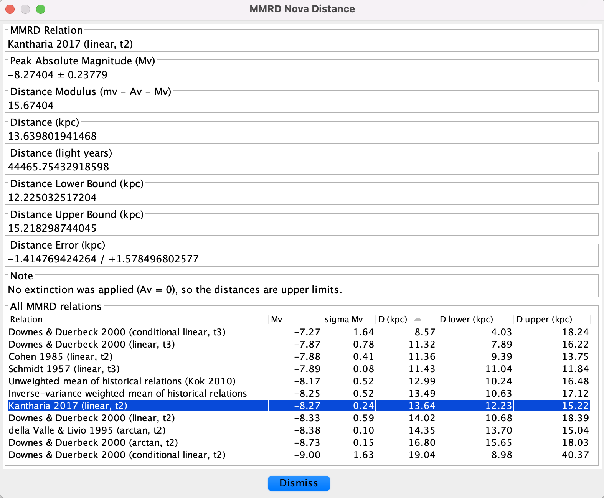

# MMRD Nova Distance Calculator

The **MMRD nova distance calculator** estimates the distance to a nova from
its rate of decline after maximum light. It is intended to do for novae what
the Leavitt's Law distance calculator does for Cepheids: combine a measured
light-curve quantity with a published luminosity calibration and the distance
modulus.

This plug-in appears in VStar's **Tool** menu as **MMRD nova distance
calculator**.

## References

The implementation is based primarily on:

- Kantharia, N. G. 2017, *Novae: I. The maximum magnitude relation with
  decline time (MMRD) and distance*, arXiv:1703.04087.
- Kok, Y. 2010, *Absolute Magnitudes and Distances of Recent Novae*, JAAVSO,
  38, 193.

The historical MMRD calibrations are taken from Kok's summary of Schmidt
(1957), Cohen (1985), della Valle & Livio (1995), and Downes & Duerbeck
(2000), with the sign convention cross-checked against Kantharia (2017).

## What the Calculator Does

The maximum magnitude versus rate of decline (MMRD) method estimates the peak absolute magnitude, $M_V$, from the time taken for a nova to decline by
2 or 3 magnitudes from maximum:

- $t_2$: days from maximum to maximum + 2 magnitudes.
- $t_3$: days from maximum to maximum + 3 magnitudes.

Once $M_V$ is estimated, the distance is computed from the extinction-corrected
distance modulus:

$$
D = 10^{0.2(m_V - A_V - M_V + 5)} \text{ pc}
$$

where:

- $m_V$ is the peak apparent magnitude,
- $A_V$ is visual extinction,
- $D$ is distance in parsecs.

The result dialog reports distance in kiloparsecs (kpc), which is the unit used
in the nova distance literature, and includes light years for the point estimate
as a convenience.

If $A_V = 0$, the reported distance should be treated as an upper limit unless
extinction is known to be negligible.

## Basic Workflow

1. Load nova observations, preferably around the outburst and early decline.
2. Choose **Tool > MMRD nova distance calculator**.
3. Select the observation series to use.
4. Choose a source for $t_2$ and $t_3$:
   - **Exponential model fit (Kok 2010, eq. 10)** for raw visual or V data.
   - **Directly from observations** only for clean or already-smoothed data.
5. Review or edit $m_V$, $t_2$, $t_3$, optional $\sigma t_2$ and
   $\sigma t_3$, and extinction.
6. Choose an MMRD relation. The equation and error source update as you change
   the drop-down.
7. Click **OK**. The results dialog shows the selected relation in detail and a
   summary table of **every** MMRD relation applied to the same $m_V$, $t_2$,
   $t_3$, and $A_V$.
8. Dismiss the results dialog to return to the input dialog. You can then
   choose a different relation, adjust extinction or decline times, and
   compare again. Series selection and the exponential fit are **not**
   repeated. Click **Cancel** on the input dialog to leave the plug-in.

## Example: V4633 Sgr

### Choosing the JD Range

For comparison with Kok (2010), use the same outburst window shown in the
paper's figures. For example, Kok's Figure 4 for V4633 Sgr has an x-axis
labelled `JD + 2450894.5000` and spans 0 to 60 days, corresponding to:

$$
2450894.5 \le JD \le 2450954.5
$$

Using a substantially longer time range can change the exponential fit, the asymptote, and hence $t_2$ and $t_3$.

As per the steps above:

1. Load V4633 Sgr observations from the AAVSO International Database with start and end JD: 2450894.5 and 2450954.5
2. Choose **Tool > MMRD nova distance calculator**.
3. Select the Visual observation series.
4. Choose **Exponential model fit (Kok 2010, eq. 10)** for visual data (the default) and click **OK**.

## Light-Curve Parameter Sources

### Exponential Model Fit

This option fits Kok's equation (10):

$$
m(t) = P_1 - P_2 e^{-P_3(t-t_0)}
$$

The fit is performed from the brightest observation onward. The plug-in then
measures $t_2$ and $t_3$ as the fitted curve's crossing times at
$m_0 + 2$ and $m_0 + 3$, where $m_0$ is the observed maximum magnitude.

This is the recommended source for raw AID visual data. Raw observations can
scatter above and below a smooth decline, so direct crossing detection may
find a too-early crossing.

This is the same fit provided by the standalone **Nova Exponential Decline
Model** plug-in; see its documentation for
the parameters, decline-time derivation, fit metrics, and uncertainty handling.

### Directly from Observations

This option finds the brightest observation and linearly interpolates the
first crossings at peak + 2 and peak + 3 magnitudes. It is useful for clean,
well-sampled, monotonic data or a precomputed model/means series, but is not
recommended for noisy visual data.

## MMRD Relations

The default relation is:

$$
M_{V,0} = 2.16 \log_{10}(t_2) - 10.804
$$

from Kantharia (2017). It is the preferred modern single-relation calibration
and remains first in the drop-down menu.

The plug-in also includes historical relations and two aggregate options:

- **Unweighted mean of historical relations (Kok 2010)**: mean of the
  historical Kok relations; error is the inter-relation scatter. This is the
  best option for reproducing Kok's Table 3 and Table 4.
- **Inverse-variance weighted mean of historical relations**: weighted mean
  using the published coefficient errors and optional $t_2/t_3$ errors. Its
  reported error is the larger of the formal weighted error and the
  inter-relation scatter, avoiding over-precise error bars when calibrations
  disagree.

Individual historical relations are also available for comparison and study.
After the exponential fit (or direct extraction) has supplied $t_2$ and $t_3$,
you can switch among these relations from the drop-down without starting the
plug-in again. The results dialog also lists every relation in one table, so a
single **OK** is enough to see how the calibrations differ.

### Table 4 in Kok (2010)

Kok's Table 4 columns are not different MMRD relations. They are different
extinction assumptions applied to the same Table 3 absolute magnitude:

- $A_V(1)$ and $D(1)$ use the Schlegel et al. (1998) full line-of-sight
  extinction.
- $A_V(2)$ and $D(2)$ use the Arenou et al. (1992) three-dimensional
  extinction model.
- $D(r)$ lists distances from other published work.

To reproduce Table 4, use Kok's Table 1 values for $m_0$, $t_2$, and $t_3$,
select **Unweighted mean of historical relations (Kok 2010)**, and enter the
appropriate $A_V$ value from Table 4.

## Extinction

You can enter either:

- $A_V$ directly, or
- reddening $E(B-V)$, in which case the plug-in uses:

$$
A_V = 3.1 E(B-V)
$$

If both are supplied and $A_V$ is non-zero, $A_V$ takes precedence.

## Error Bars and Bounds

The papers use error bars at several stages, and these do not all mean the
same thing. The plug-in keeps the stages explicit:

| Stage | Meaning |
|-------|---------|
| $\sigma t_2$, $\sigma t_3$ | uncertainty in the decline times |
| $\sigma M_V$ for a single relation | propagated from published coefficient errors and optional $t_2/t_3$ errors |
| $\sigma M_V$ for unweighted mean | scatter among the historical relations |
| $\sigma M_V$ for inverse-variance mean | max(formal weighted error, inter-relation scatter) |
| distance bounds | $\sigma M_V$ propagated through the distance modulus |

When the **Exponential model fit (Kok 2010, eq. 10)** source is used, the
$\sigma t_2$ and $\sigma t_3$ fields are filled in automatically by propagating
the fit's parameter uncertainties through the closed-form crossing time (see
the Nova Exponential Decline Model documentation). If the fit cannot estimate
those uncertainties, or the decline times are taken directly from the
observations, the fields are left blank; you may enter values manually, for
example from a published table.

Distance bounds are shown in kpc as lower and upper bounds rather than a single
symmetric error, because distance depends exponentially on magnitude. A
symmetric $\sigma M_V$ usually becomes an asymmetric distance interval.

The results dialog repeats those bounds for the relation selected in the
drop-down, and the summary table reports $M_V$, $\sigma M_V$, and the
corresponding distance interval for every relation, rounded to two decimal
places. The table opens sorted by increasing distance; click any column header
to sort by that column (numeric columns sort by value, not as text). Click a
row to highlight it; the relation chosen in the drop-down is selected
initially. Relations that cannot be evaluated (for example a $t_3$
calibration when $t_3$ is missing) appear as `n/a` and sort last.

## Limitations

- The plug-in does not look up extinction automatically.
- The Kok aggregate is a reconstruction; Kok's paper does not include source
  code or a fully specified weighting implementation.
- The MMRD method is empirical and calibration-dependent.
- Raw visual data can make peak detection and direct crossing detection
  fragile; use the exponential fit and inspect the model series.
