# O-C plug-in

## Overview

This plug-in computes **O-C** (observed minus computed) values for times of
light-curve extrema and displays an O-C diagram. A fixed test ephemeris (period
and epoch) is compared against observed times of maximum (or minimum) light to
reveal timing errors.

Primary reference for the six-clock O-C tutorial (Tables 13.1–13.2): AAVSO
*Variable Star Astronomy*, chapter 13 — freely available PDF:
[Variable Stars and O–C Diagrams](https://www.aavso.org/sites/default/files/education/vsa/Chapter13.pdf)
(Grant Foster). The same material appears in Foster, *Analyzing Light Curves*,
ch. 13.

Two plug-ins are provided.

| Plug-in | Menu | Role |
|---------|------|------|
| O-C | **Tools → O-C…** | Main O-C tool (includes **Export CSV…** in results) |
| O-C demo data | **File → O-C demo data…** | Optional Foster clock light curves |

The O-C tool can be opened from the **Tools** menu, even when
no observations have been loaded, since other than a **From
observations** option, an **Imported timings file** option allows a previously exported/created timings file to be opened instead.

Published help (PDF): [O-C on aavso.github.io](https://aavso.github.io/VStar/docs/vstar/release/plugin/OCAnalysis.pdf).

## Installation

1. In VStar, choose **Tools → Plug-in Manager…**
2. Select and install **O-C** (required). Optionally install **O-C
   demo data** for Foster tutorial light curves.
3. **Close and restart VStar** so new menu items appear.

See also
[AAVSO VStar Plug-in Library](https://www.aavso.org/vstar-plugin-library).

Optional: **File → Preferences… → Plug-in Settings** to check the plug-in
download URL matches your VStar version (see the
[VStar wiki installation recipes](https://github.com/AAVSO/VStar/wiki/Installation-Recipes)).

## Quick start

1. **Tools → O-C…**
2. Set **data source**, ephemeris (period and epoch), and other options in the
   parameter dialog.
3. Click **OK** (a file chooser opens if you chose **Imported timings file**).
4. Review the results dialog: **O-C diagram**, **Data table**, and **Fit
   summary**.

See **Examples** for Foster demo walkthroughs. **Appendix A** covers all six
clocks (demo light curves or imported timings). For a typical workflow on your
own AID data (measure → export CSV → re-import), see **Appendix C**.

## Examples

These three walkthroughs use the optional **O-C demo data** plug-in (no real
star or downloaded timing file required). Install it if needed (see
**Installation**), then restart VStar. Each example uses the VSA/Foster test
ephemeris **P = 1.0 d**, **epoch = 2450000.0** (Tables 13.1–13.2 in the
[Chapter 13 PDF](https://www.aavso.org/sites/default/files/education/vsa/Chapter13.pdf)).

| Example | Demo scenario (VSA clock) | Purpose |
|---------|---------------------------|---------|
| **1** | Foster clock 4 — epoch jump | Two-segment fit with **parallel** segments |
| **2** | Foster clock 5 — period change | Compare linear, quadratic, and two-segment (**different slopes**) |
| **3** | Foster clock 6 — slowing clock | Compare **linear** vs **quadratic** for a curved O-C |

Clocks 1–3 (correct ephemeris, epoch offset, period error) are covered in
**Appendix A**. Demo menu labels keep the “Foster clock” wording used in the
plug-in; the numbers and tables are those of the VSA chapter.

Shared setup for each example (details only in Example 1; abbreviated later):

1. **File → O-C demo data…** → choose the demo scenario for that clock → **OK**.
2. **Tools → O-C…** → **From observations** → **Star metadata** → **Event:**
   Maximum → **Timing method:** Parabolic interpolation → **OK** → select
   **Johnson V**.

### Example 1 — Epoch jump (clock 4)

A sudden step in O-C with unchanged slope on each side (VSA Table 13.2, clock 4).

1. Load **Foster clock 4 — epoch jump** and open O-C as in the shared setup.
   Note the load-message hint: break cycle **3** (cycles 0–3 are the pre-jump
   plateau; cycle 4 is already post-jump).
2. On the **O-C diagram**, the points step upward at cycle 4. Select
   **Two-segment**, enter **Break cycle** **3**, click **Apply**. Both
   segments should be nearly flat (slope ≈ 0) with different intercepts.

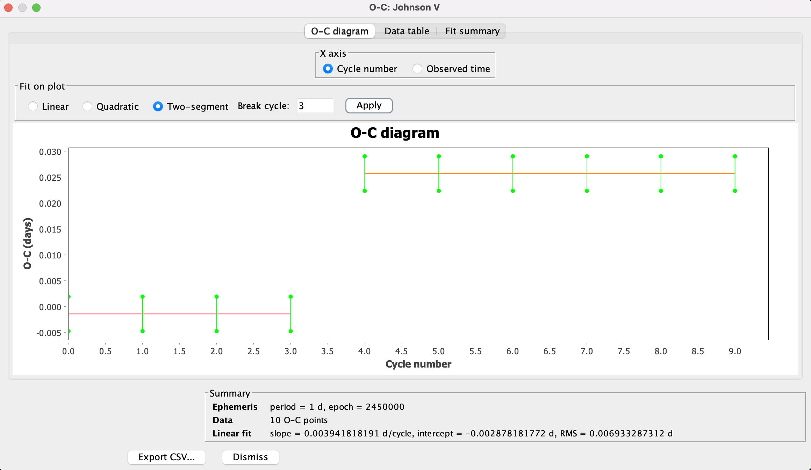

3. Open **Fit summary**. The **Interpretation** should describe parallel
   segments (epoch jump with unchanged period).

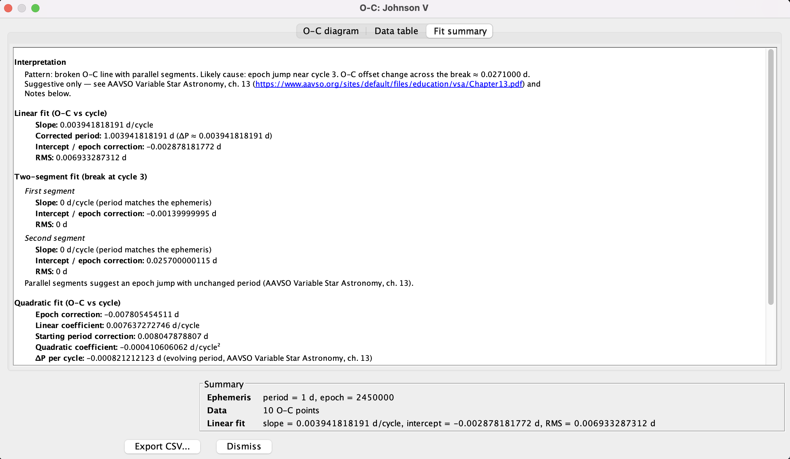

### Example 2 — Period change (clock 5)

A slope change mid-run: a single line or parabola is a poor model; two segments
with different slopes match Table 13.2 (clock 5).

1. Load **Foster clock 5 — period change** and open O-C as in the shared setup.
   Note the hint: break cycle **5** (cycles 0–5 are the first slope; cycle 6
   starts the new regime).
2. Leave **Fit on plot** on **Linear**. The points show a kink; one line is only
   a compromise across both segments.

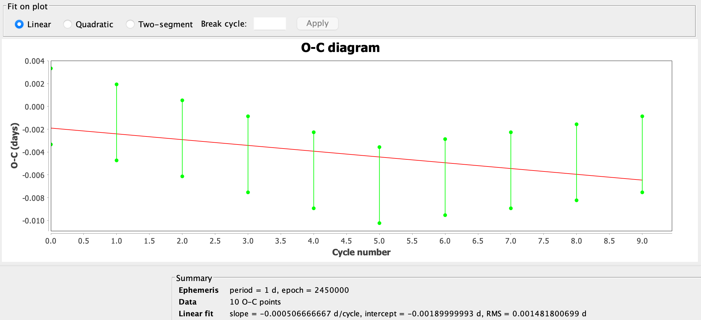

3. Switch to **Quadratic**. A parabola may look somewhat better, but it still
   does not capture a sharp period change at one cycle.

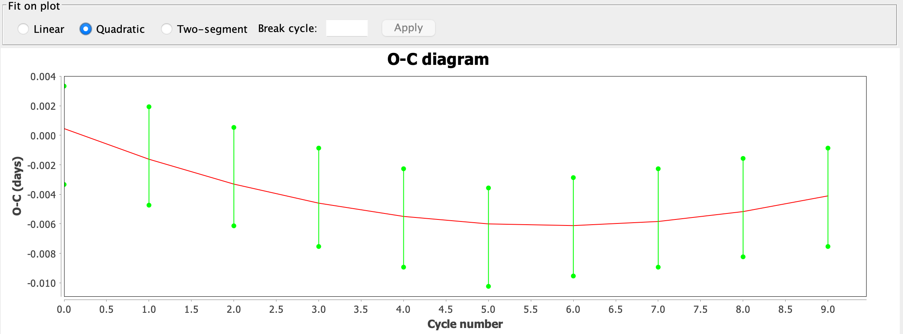

4. Switch to **Two-segment**, enter **Break cycle** **5**, click **Apply**.
   Separate lines before and after the break should show different slopes.

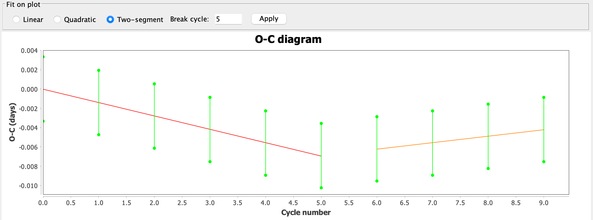

5. Open **Fit summary**. With **Two-segment** selected, the **Interpretation**
   should report a period change. Switch **Fit on plot** back to **Linear** or
   **Quadratic** and return to **Fit summary** — the text follows the fit shown
   on the diagram. Compare with Example 1 (parallel segments / epoch jump).

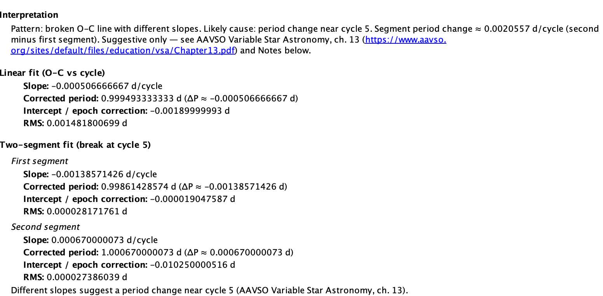

### Example 3 — Evolving period (clock 6)

A smoothly curving O-C from an evolving period (Table 13.2, clock 6). Here
**linear** vs **quadratic** is the main contrast (no break cycle required).

1. Load **Foster clock 6 — slowing clock** and open O-C as in the shared setup.
2. Leave **Fit on plot** on **Linear**. A straight line cannot follow the curve.

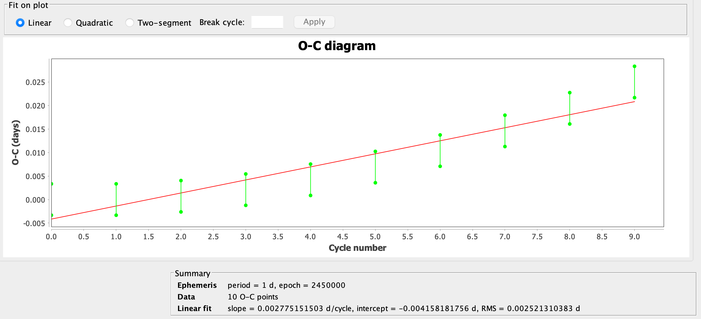

3. Switch to **Quadratic**. The parabola should track the points.

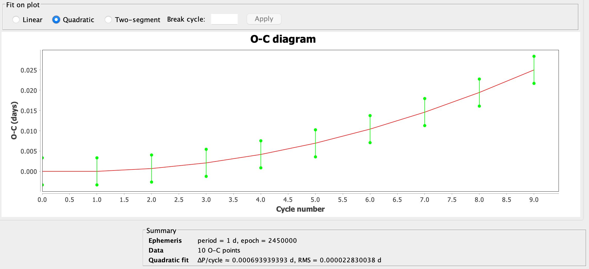

4. **Fit
   summary** should interpret a curved O-C (evolving period) when **Quadratic**
   is selected.
   
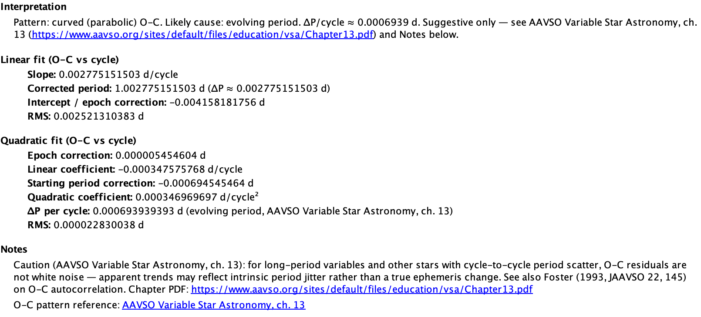

### Further reading — X Tri, eclipsing binaries, and other real stars

The VSA chapter also discusses real variables (e.g. X Tri, SU Vir, Z Aur) with
O-C diagrams built from published **times of maxima** over many cycles. Those
examples need literature ephemerides and timing tables; they are not bundled
with this plug-in. The **Examples** above use clocks 4–6 from the
[Chapter 13 PDF](https://www.aavso.org/sites/default/files/education/vsa/Chapter13.pdf);
use **Appendix A** for all six clocks (demo light curves or imported timings).
For real stars, obtain timings from the literature or measure extrema from your
own observations, then run O-C with **From observations** or **Imported
timings** (see **Appendix C** for an AID export/re-import outline).

For **eclipsing binaries**, decades of **eclipse timings** can reveal
**apsidal motion** (sinusoidal O-C from general relativity and tidal distortion)
or **period change** from mass transfer; those effects need long baselines.

## Results dialog

After O-C is computed, a modeless results window opens with three tabs:

| Tab | Contents |
|-----|------------|
| **O-C diagram** | O-C points (optional error bars); **X axis** and **Fit on plot** controls |
| **Data table** | Cycle, observed time, computed time, O-C, uncertainty |
| **Fit summary** | Pattern interpretation for the selected fit, plus fit details |

**Fit on plot** — radio buttons choose which fit is drawn:

| Option | When available | Notes |
|--------|----------------|-------|
| **Linear** | ≥2 O-C points | Default; single least-squares line |
| **Quadratic** | ≥3 O-C points | Curved trend (Foster clock 6 / evolving period) |
| **Two-segment** | ≥4 O-C points | Enable **Break cycle** + **Apply** on the same row |

**Fit summary** — leads with an **Interpretation** paragraph for the fit
currently selected on the diagram (VSA / Foster ch. 13 patterns). Fit coefficients
and the LPV period-scatter caution follow below.

**Export CSV…** on the results dialog saves O-C points and fit metadata to a
file.

## Components (summary)

### O-C tool

Parameter dialog uses a compact two-column layout. **Ephemeris source** is a
drop-down only (not typable); edit **Period** and **Epoch** in their fields.

After **OK**, choose an observation series or a timings file depending on
**Data source**; the results dialog opens next. Use **Export CSV…** there to
save results.

### O-C demo data (observation source)

Optional. Loads synthetic light curves whose **maximum timings** match
Tables 13.1–13.2 of the
[VSA Chapter 13 PDF](https://www.aavso.org/sites/default/files/education/vsa/Chapter13.pdf)
(clocks 1–6). Bump shape is identical for every clock; only timing
differs. Then run **Tools → O-C…** with **From observations** and the
suggested ephemeris from the load message (P = 1 d).

---

## Appendix A — Validation against VSA Tables 13.1–13.2

The six test clocks (theory **P = 1 day**, **epoch = cycle 0**) are from AAVSO
*Variable Star Astronomy* chapter 13
([PDF](https://www.aavso.org/sites/default/files/education/vsa/Chapter13.pdf)).
Computed time C_n = n. O-C = O_n − C_n (Table 13.2). The same tables appear in
Foster, *Analyzing Light Curves*, ch. 13.

### Reference O-C values (Table 13.2)

| Cycle | Clock 1 | Clock 2 | Clock 3 | Clock 4 | Clock 5 | Clock 6 |
|------:|--------:|--------:|--------:|--------:|--------:|--------:|
| 0 | 0 | +0.0035 | 0 | −0.0014 | 0 | 0 |
| 1 | 0 | +0.0035 | +0.0021 | −0.0014 | −0.0014 | 0 |
| 2 | 0 | +0.0035 | +0.0042 | −0.0014 | −0.0028 | +0.0007 |
| 3 | 0 | +0.0035 | +0.0062 | −0.0014 | −0.0042 | +0.0021 |
| 4 | 0 | +0.0035 | +0.0083 | **+0.0257** | −0.0056 | +0.0042 |
| 5 | 0 | +0.0035 | +0.0104 | +0.0257 | −0.0069 | +0.0069 |
| 6 | 0 | +0.0035 | +0.0125 | +0.0257 | −0.0062 | +0.0104 |
| 7 | 0 | +0.0035 | +0.0146 | +0.0257 | −0.0056 | +0.0146 |
| 8 | 0 | +0.0035 | +0.0167 | +0.0257 | −0.0049 | +0.0194 |
| 9 | 0 | +0.0035 | +0.0188 | +0.0257 | −0.0042 | +0.0250 |

### Demo scenario mapping

| VSA / Foster clock | Demo menu label | Expected in plug-in |
|--------------|-----------------|---------------------|
| 1 | Foster clock 1 — correct ephemeris | Flat O-C ≈ 0 |
| 2 | Foster clock 2 — epoch offset | Flat O-C ≈ +0.0035 d |
| 3 | Foster clock 3 — period error | Slope ≈ +0.0021 d/cycle |
| 4 | Foster clock 4 — epoch jump | Step at cycle 4; break **3** |
| 5 | Foster clock 5 — period change | Slope change; break **5** |
| 6 | Foster clock 6 — slowing clock | Curved O-C; select **Quadratic** on Fit on plot |

### Method A — imported timings

For each clock, download the timing file (links below), then:

1. **Tools → O-C…** → **Imported timings file**.
2. **Period:** 1.0 d, **Epoch:** 2450000.0.
3. Compare O-C and **Fit summary** to Table 13.2.

### Method B — demo observation source

See **Examples** for clocks 4–6. For any clock:

1. **File → O-C demo data…** → pick a Foster clock (labels match the
   demo scenario mapping table above).
2. **Tools → O-C…** → **From observations**; use the suggested
   ephemeris from the load message (**Star metadata** pre-fills period and
   epoch).
3. Compare O-C, **Fit on plot**, and **Fit summary** to Table 13.2.

### Timing files (Table 13.1 → times)

Epoch **2450000.0**, period **1.0** d for O-C tool entry. Download from
[aavso.github.io](https://aavso.github.io/VStar/docs/vstar/release/plugin/foster/)
(published with plug-in docs; same files in `plugin/doc/foster/` in the repo).

| Clock | Scenario | Download |
|-------|----------|----------|
| 1 | Correct ephemeris | [foster_clock1.txt](https://aavso.github.io/VStar/docs/vstar/release/plugin/foster/foster_clock1.txt) |
| 2 | Epoch offset | [foster_clock2.txt](https://aavso.github.io/VStar/docs/vstar/release/plugin/foster/foster_clock2.txt) |
| 3 | Period error | [foster_clock3.txt](https://aavso.github.io/VStar/docs/vstar/release/plugin/foster/foster_clock3.txt) |
| 4 | Epoch jump (try break cycle 3) | [foster_clock4.txt](https://aavso.github.io/VStar/docs/vstar/release/plugin/foster/foster_clock4.txt) |
| 5 | Period change (try break cycle 5) | [foster_clock5.txt](https://aavso.github.io/VStar/docs/vstar/release/plugin/foster/foster_clock5.txt) |
| 6 | Slowing clock (Quadratic on Fit on plot) | [foster_clock6.txt](https://aavso.github.io/VStar/docs/vstar/release/plugin/foster/foster_clock6.txt) |

---

## Appendix B — Reference

### Ephemeris source

When **From observations** is selected:

| UI label | Meaning |
|----------|---------|
| **Phase plot** | Period and epoch from the **active phase plot** (View → Phase Plot, or Period Analysis → New Phase Plot) |
| **Star metadata** | Period and epoch from the **loaded star record** (often from an AID download or other source that supplies catalogue fields) |
| **Manual entry** | Type period and epoch yourself |

Disabled for **Imported timings** — enter period and epoch directly, unless
the file is an O-C export CSV (metadata is read from the file).

### Imported timings file format

One timing per line: `cycle time [sigma]` or `time [sigma]`. Whitespace, comma,
or semicolon separators. `#` comments allowed.

Use **one consistent time system** for observations, epoch, and imported
timings (JD, HJD, BJD_TDB, etc.). The plug-in does not convert between systems;
mix them and O-C will be wrong. Homogenise with VStar’s HJD/BJD tools first if
needed.

You can also re-open a file saved with **Export CSV…** from a previous O-C run.
The tool reads timings from the data rows and, for export files, fills in
**Period**, **Epoch**, and **Event** from the `# period=…, epoch=…` comment and
the `Event` column (leave those fields blank in the parameter dialog). Export
columns are `O_time` and `C_time` (not a specific JD flavour).

### Timing methods (From observations)

- **Parabolic interpolation** — parabolic refinement at discrete extremum.
- **Mean JD of extreme N%** — mean time of brightest N% in each cycle.
- **From current model function** — analytic extrema from a JD-based model.

### Event type

- **Maximum** or **Minimum**
- **Both maxima and minima** — for eclipsing binaries on real data (not used in
  six-clock tutorial in the VSA Chapter 13 PDF)

### Interpreting O-C diagrams

| Pattern | Likely cause |
|---------|----------------|
| Flat at 0 | Ephemeris matches |
| Flat, offset | Epoch wrong, period OK |
| Linear slope | Period wrong |
| Broken line, parallel segments | Epoch jump |
| Broken line, different slopes | Period change |
| Curved (parabolic) | Evolving period → select **Quadratic** on the diagram |

### Two-segment fit

On the **O-C diagram** tab: select **Two-segment**, enter a **break cycle**,
click **Apply**. Needs ≥4 O-C points and ≥2 per segment.

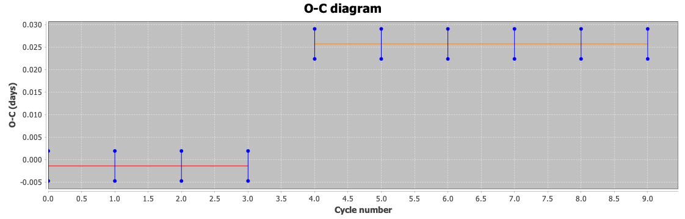

### Parameters (initial dialog)

| Parameter | Description |
|-----------|-------------|
| Data source | Observations or imported timings |
| Ephemeris source | Pre-fill (observations only) |
| Period, epoch | Test ephemeris (required; same time system as the data) |
| Event | Maximum, minimum, or both |
| Timing method, extreme N%, min obs | Observations only |

### Fit summary (after results)

| Output | When |
|--------|------|
| Interpretation | Updates with the fit selected under **Fit on plot** |
| Linear fit details | ≥2 O-C points |
| Quadratic fit details | ≥3 O-C points |
| Two-segment fit details | After **Apply** with a break cycle |

---

## Appendix C — AID workflow (export and re-import)

Typical path on your own data: measure extrema from a loaded light curve,
export timings, then re-open them without reprocessing the AID.

**Suggested target:** **RZ Cas** (AUID `000-BBF-490`), Algol-type EA.
Period ≈ **1.20 d** (VSX). **Suggested JD range:** **2452700 – 2461000**
(about 22 years); load **V** only.

1. Load **RZ Cas** from the AAVSO International Database with the JD range and
   **V** series above.
2. **Tools → O-C…** → **From observations** → **Star metadata** → **Event:**
   Minimum → **OK** → select **V**.
3. Review the diagram, then **Export CSV…** (e.g. `rz_cas_timings.csv`).
4. **Tools → O-C…** again → **Imported timings file** → select the CSV.
   Period, epoch, and event are taken from the export metadata when present.

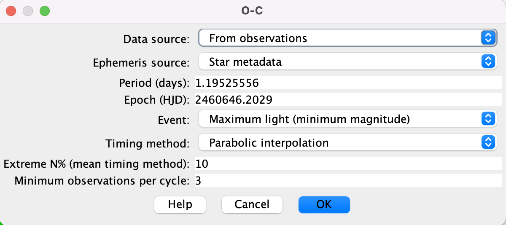

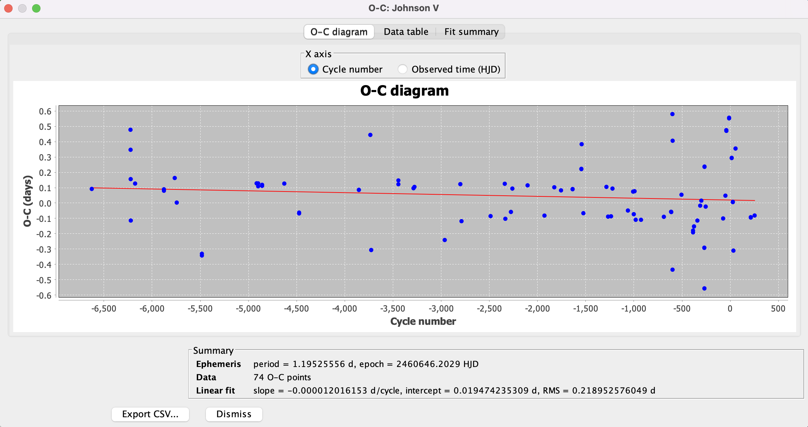

---

## References

- AAVSO *Variable Star Astronomy*, chapter 13 (Grant Foster) — free PDF:
  [Variable Stars and O–C Diagrams](https://www.aavso.org/sites/default/files/education/vsa/Chapter13.pdf)
  (primary reference for Tables 13.1–13.2 and the six-clock examples)
- Foster, G. *Analyzing Light Curves*, O-C Analysis, ch. 13, pp. 263–282
  (same clock material; book form)
- [VStar plug-in library](https://www.aavso.org/vstar-plugin-library)
- [VStar issue #93](https://github.com/AAVSO/VStar/issues/93)

## Version history

- **1.10** — Examples rewritten around VSA/Foster clocks 4–6; cite free
  [VSA Chapter 13 PDF](https://www.aavso.org/sites/default/files/education/vsa/Chapter13.pdf)
  as primary reference for Tables 13.1–13.2; AID export/re-import moved to
  Appendix C; Results dialog docs updated for **Fit on plot** and
  interpretation.
- **1.9** — `OCAnalysisTool.test()` smoke check (Foster clock 2) for plug-in
  harness coverage.
- **1.8** — Neutral time labels (`O_time` / `C_time`, Epoch, Observed time);
  docs stress a consistent time system (JD/HJD/BJD/…) rather than assuming HJD.
  Removed unused O-C CSV observation-sink plug-in (export is results-dialog only).
- **1.7** — Added screenshots for parameter dialog, results diagram, Fit
  summary, and two-segment fit.
- **1.6** — User-facing rename: **O-C** (Tools menu) and **O-C demo
  data** (File menu); plug-in group **Timing**.
- **1.5** — Example 2 uses O-C demo data (Foster clock 2); Foster
  `.txt` downloads remain in Appendix A Method A only.
- **1.4** — User-facing doc restructure: Plug-in Manager install, examples,
  appendices, Foster timings on aavso.github.io (absolute URLs), screenshot
  placeholders.
- **1.3** — Foster Table 13.1 demo timings; six clocks only; compact dialog;
  general tool; break cycle on Fit summary.
- **1.2** — Imported timings, CSV export, quadratic fit, BOTH event type, demo
  observation source.
- **1.1** — Model timing, linear/two-segment fits, error bars.
- **1.0** — Initial observation-based O-C plot and table.
