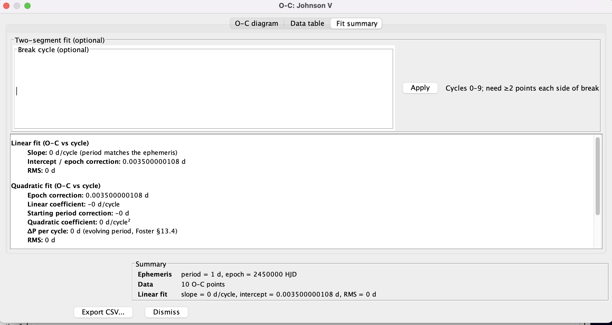

# O-C plug-in

## Overview

This plug-in computes **O-C** (observed minus computed) values for times of
light-curve extrema and displays an O-C diagram. A fixed test ephemeris (period
and epoch) is compared against observed times of maximum (or minimum) light to
reveal timing errors.

Primary reference: Grant Foster, *Analyzing Light Curves*, chapter 13 (AAVSO
Variable Star Analytics; clock analogy in Tables 13.1–13.2).

Two plug-ins are provided.

| Plug-in | Menu | Role |
|---------|------|------|
| O-C | **Tools → O-C…** | Main O-C tool (includes **Export CSV…** in results) |
| O-C demo data | **File → O-C demo data…** | Optional Foster clock light curves |

The O-C tool can be opened from the **Tools** menu even when
no observations have been loaded, since apart from a **From
observations** option, an **Imported timings file** option allows a timings file to be opened instead.

Published help (PDF): [O-C on aavso.github.io](https://aavso.github.io/VStar/docs/vstar/release/plugin/OCAnalysis.pdf).

## Installation

1. In VStar, choose **Tools → Plug-in Manager…**
2. Select and install **O-C** (required). Optionally install **O-C
   demo data** for Foster tutorial light curves.
3. **Close and restart VStar** so new menu items appear.

See also
[AAVSO VStar Plug-in Library](https://www.aavso.org/vstar-plugin-library).

Optional: **File → Preferences… → Plug-in Settings** to check the plug-in
download URL matches your VStar version (see the
[VStar wiki installation recipes](https://github.com/AAVSO/VStar/wiki/Installation-Recipes)).

## Quick start

1. **Tools → O-C…**
2. Set **data source**, ephemeris (period and epoch), and other options in the
   parameter dialog.
3. Click **OK** (a file chooser opens if you chose **Imported timings file**).
4. Review the results dialog: **O-C diagram**, **Data table**, and **Fit
   summary**.

See **Examples** for walkthroughs. **Example 2** uses the optional demo
observation source; **Appendix A** covers Foster validation (including
imported timings for all six clocks).

## Examples

These walkthroughs build on each other:

| Example | Purpose |
|---------|---------|
| **1** | Real AID light curve → measure timings → export CSV → re-import timings (typical workflow on your own data) |
| **2** | Bundled Foster clock 2 demo → validate the tool against a known O-C offset (no download or real star required) |

Use **Appendix A** to validate the other Foster clocks or to import pre-computed timing files.

### Example 1 — O-C from loaded observations (AID data)

Use this when you have a light curve in VStar and want times of eclipse minima
(or maxima) measured from the data.

**Suggested target:** **RZ Cas** (AUID `000-BBF-490`), a bright Algol-type
eclipsing binary (EA). Period ≈ **1.20 d** (VSX), good AAVSO **V** coverage,
and a deep primary minimum suited to parabolic timing.

**Suggested JD range:** **2452700 – 2461000** HJD (about 22 years; calendar
**2003-03-01** through **2025-11-20**). The AID holds **9000+ V** observations
in this span. In the load dialog, enter those minimum and maximum JD values and
select **V** only (clear other series checkboxes).

1. Load the star from the AAVSO International Database (**File → New Star from
   AAVSO Database…**): star name **RZ Cas**, JD range and **V** series as above.
2. Optional: refine period and epoch with **period analysis** or a **phase
   plot** if you plan to use **Phase plot** as the ephemeris source (see
   **Appendix B**). For this example, **Star metadata** (VSX period and epoch)
   is enough to start.
3. **Tools → O-C…**
4. **Data source:** From observations.
5. **Ephemeris source:** **Star metadata** (VSX values loaded with the star).
6. **Event:** Minimum (primary eclipse). **Timing method:** Parabolic
   interpolation. **Minimum observations per cycle:** 3 (defaults are fine if
   already set).
7. Click **OK**, select the **V** series if prompted.
8. On the **O-C diagram**, check the trend. Open **Fit summary** for linear
   (and, if applicable, quadratic) interpretation text. Over many years, EB O-C
   can show real long-term effects (apsidal motion, mass transfer); see
   **Further reading** below.
9. Click **Export CSV…** in the results dialog and save the file (e.g.
   `rz_cas_timings.csv`). The export lists each timed eclipse (`Cycle`,
   `O_HJD`, optional `OC_sigma`) plus O-C columns and fit metadata in `#`
   comment lines.
10. **Tools → O-C…** again (no star loaded is fine).
11. **Data source:** Imported timings file → **OK** → select the CSV from step 9.
12. Leave **Period**, **Epoch**, and **Event** at their defaults — an O-C export
    CSV supplies these from its `# period=…, epoch=…` comment and `Event` column.
    Click **OK** again. The O-C diagram should match step 8 without re-processing
    the AID light curve.

### Example 2 — O-C from demo light curve (Foster clock 2)

Use this to walk through Foster's clock analogy with bundled synthetic data —
no real star or downloaded timing file required. This example loads Foster
clock 2 light curves whose maxima match Table 13.1 and should yield a flat O-C
offset of **+0.0035 d** (Table 13.2).

1. Install the optional **O-C demo data** plug-in if needed (see
   **Installation**), then restart VStar.
2. **File → O-C demo data…**
3. **Demo scenario:** **Foster clock 2 — epoch offset** → **OK**.
4. Read the load message. Note the **suggested ephemeris** for Foster test
   theory: **P = 1.0 d**, **epoch = 2450000.0 HJD**, and the expected flat O-C
   ≈ **+0.0035 d**.
5. **Tools → O-C…**
6. **Data source:** From observations.
7. **Ephemeris source:** **Star metadata** (pre-fills the suggested period and
   epoch from step 4). **Event:** Maximum. **Timing method:** Parabolic
   interpolation (defaults are fine).
8. Click **OK**, select the **V** series if prompted.
9. Review results: O-C should be flat near **+0.0035 d** on every cycle (Foster
   Table 13.2, clock 2). Open **Fit summary** for the linear-fit interpretation.

To validate the other Foster clocks from light curves, repeat steps 2–9 with a
different **Demo scenario** (see **Appendix A**, demo scenario mapping). To
validate from pre-computed times instead, use **Appendix A**, Method A.

### Further reading — X Tri, eclipsing binaries, and other real stars

Foster discusses real variables (e.g. X Tri, SU Vir, Z Aur) with O-C diagrams
built from published **times of maxima** over many cycles. Those examples need
literature ephemerides and timing tables; they are not bundled with this
plug-in. **Example 2** walks through Foster clock 2 via the demo source; use
**Appendix A** for all six clocks (demo light curves or imported timings). For real
stars, obtain timings from the literature or measure extrema from your own
observations, then run O-C with **From observations** or **Imported timings**.

For **eclipsing binaries**, decades of **eclipse timings** can reveal
**apsidal motion** (sinusoidal O-C from general relativity and tidal distortion)
or **period change** from mass transfer; those effects need much longer baselines
than Example 1.

## Results dialog

After O-C is computed, a modeless results window opens with three tabs:

| Tab | Contents |
|-----|------------|
| **O-C diagram** | O-C points (optional error bars); toggle **Cycle number** or **Observed time (HJD)** on the x-axis |
| **Data table** | Cycle, observed time, computed time, O-C, uncertainty |
| **Fit summary** | Interpretation text for fits (see below) |

**Linear fit** — computed automatically when there are at least two O-C points;
shown as a line on the diagram and described on **Fit summary**.

**Quadratic fit** — there is **no** quadratic option in the parameter dialog.
When there are at least three O-C points, a quadratic least-squares fit of O-C
versus cycle is computed automatically and described **only on Fit summary**
(text, not drawn on the chart). Use this for curved O-C trends (Foster clock
6 / evolving period).

**Two-segment fit** — optional. On **Fit summary**, enter a **break cycle** and
click **Apply** (see **Appendix B**). Needs at least four O-C points and at
least two on each side of the break.

**Export CSV…** on the results dialog saves O-C points and fit metadata to a
file.

## Components (summary)

### O-C tool

Parameter dialog uses a compact two-column layout. **Ephemeris source** is a
drop-down only (not typable); edit **Period** and **Epoch** in their fields.

After **OK**, choose an observation series or a timings file depending on
**Data source**; the results dialog opens next. Use **Export CSV…** there to
save results.

### O-C demo data (observation source)

Optional. Loads synthetic light curves whose **maximum timings** match Foster
Table 13.1 (clocks 1–6). Bump shape is identical for every clock; only timing
differs. Then run **Tools → O-C…** with **From observations** and the
suggested ephemeris from the load message (P = 1 d).

---

## Appendix A — Validation against Foster (Tables 13.1–13.2)

Foster’s six test clocks use theory **P = 1 day**, **epoch = cycle 0**. Computed
time C_n = n. O-C = O_n − C_n (Table 13.2).

### Reference O-C values (Table 13.2)

| Cycle | Clock 1 | Clock 2 | Clock 3 | Clock 4 | Clock 5 | Clock 6 |
|------:|--------:|--------:|--------:|--------:|--------:|--------:|
| 0 | 0 | +0.0035 | 0 | −0.0014 | 0 | 0 |
| 1 | 0 | +0.0035 | +0.0021 | −0.0014 | −0.0014 | 0 |
| 2 | 0 | +0.0035 | +0.0042 | −0.0014 | −0.0028 | +0.0007 |
| 3 | 0 | +0.0035 | +0.0062 | −0.0014 | −0.0042 | +0.0021 |
| 4 | 0 | +0.0035 | +0.0083 | **+0.0257** | −0.0056 | +0.0042 |
| 5 | 0 | +0.0035 | +0.0104 | +0.0257 | −0.0069 | +0.0069 |
| 6 | 0 | +0.0035 | +0.0125 | +0.0257 | −0.0062 | +0.0104 |
| 7 | 0 | +0.0035 | +0.0146 | +0.0257 | −0.0056 | +0.0146 |
| 8 | 0 | +0.0035 | +0.0167 | +0.0257 | −0.0049 | +0.0194 |
| 9 | 0 | +0.0035 | +0.0188 | +0.0257 | −0.0042 | +0.0250 |

### Demo scenario mapping

| Foster clock | Demo menu label | Expected in plug-in |
|--------------|-----------------|---------------------|
| 1 | Foster clock 1 — correct ephemeris | Flat O-C ≈ 0 |
| 2 | Foster clock 2 — epoch offset | Flat O-C ≈ +0.0035 d |
| 3 | Foster clock 3 — period error | Slope ≈ +0.0021 d/cycle |
| 4 | Foster clock 4 — epoch jump | Step at cycle 4; break **4** |
| 5 | Foster clock 5 — period change | Slope change; break **6** |
| 6 | Foster clock 6 — slowing clock | Curved O-C; quadratic on Fit summary |

### Method A — imported timings

For each clock, download the timing file (links below), then:

1. **Tools → O-C…** → **Imported timings file**.
2. **Period:** 1.0 d, **Epoch:** 2450000.0 HJD.
3. Compare O-C and **Fit summary** to Table 13.2.

### Method B — demo observation source

See **Example 2** for Foster clock 2. For any clock:

1. **File → O-C demo data…** → pick a Foster clock (labels match the
   demo scenario mapping table above).
2. **Tools → O-C…** → **From observations**; use the suggested
   ephemeris from the load message (**Star metadata** pre-fills period and
   epoch).
3. Compare O-C and **Fit summary** to Table 13.2.

### Foster timing files (Table 13.1 → HJD)

Epoch **2450000.0** HJD, period **1.0** d for O-C tool entry. Download from
[aavso.github.io](https://aavso.github.io/VStar/docs/vstar/release/plugin/foster/)
(published with plug-in docs; same files in `plugin/doc/foster/` in the repo).

| Clock | Scenario | Download |
|-------|----------|----------|
| 1 | Correct ephemeris | [foster_clock1.txt](https://aavso.github.io/VStar/docs/vstar/release/plugin/foster/foster_clock1.txt) |
| 2 | Epoch offset | [foster_clock2.txt](https://aavso.github.io/VStar/docs/vstar/release/plugin/foster/foster_clock2.txt) |
| 3 | Period error | [foster_clock3.txt](https://aavso.github.io/VStar/docs/vstar/release/plugin/foster/foster_clock3.txt) |
| 4 | Epoch jump (try break cycle 4) | [foster_clock4.txt](https://aavso.github.io/VStar/docs/vstar/release/plugin/foster/foster_clock4.txt) |
| 5 | Period change (try break cycle 6) | [foster_clock5.txt](https://aavso.github.io/VStar/docs/vstar/release/plugin/foster/foster_clock5.txt) |
| 6 | Slowing clock (quadratic on Fit summary) | [foster_clock6.txt](https://aavso.github.io/VStar/docs/vstar/release/plugin/foster/foster_clock6.txt) |

---

## Appendix B — Reference

### Ephemeris source

When **From observations** is selected:

| UI label | Meaning |
|----------|---------|
| **Phase plot** | Period and epoch from the **active phase plot** (View → Phase Plot, or Period Analysis → New Phase Plot) |
| **Star metadata** | Period and epoch from the **loaded star record** (often from an AID download or other source that supplies catalogue fields) |
| **Manual entry** | Type period and epoch yourself |

Disabled for **Imported timings** — enter period and epoch directly, unless
the file is an O-C export CSV (metadata is read from the file).

### Imported timings file format

One timing per line: `cycle HJD [sigma]` or `HJD [sigma]`. Whitespace, comma,
or semicolon separators. `#` comments allowed.

You can also re-open a file saved with **Export CSV…** from a previous O-C run.
The tool reads timings from the data rows and, for export files, fills in
**Period**, **Epoch**, and **Event** from the `# period=…, epoch=…` comment and
the `Event` column (leave those fields blank in the parameter dialog).

### Timing methods (From observations)

- **Parabolic interpolation** — parabolic refinement at discrete extremum.
- **Mean JD of extreme N%** — mean time of brightest N% in each cycle.
- **From current model function** — analytic extrema from a JD-based model.

### Event type

- **Maximum** or **Minimum**
- **Both maxima and minima** — for eclipsing binaries on real data (not used in
  Foster’s six-clock tutorial)

### Interpreting O-C diagrams

| Pattern | Likely cause |
|---------|----------------|
| Flat at 0 | Ephemeris matches |
| Flat, offset | Epoch wrong, period OK |
| Linear slope | Period wrong |
| Broken line, parallel segments | Epoch jump |
| Broken line, different slopes | Period change |
| Curved (parabolic) | Evolving period → Fit summary quadratic |

### Two-segment fit

On **Fit summary** after results: enter **break cycle**, click **Apply**. Needs ≥4 O-C points and ≥2 per segment.

### Parameters (initial dialog)

| Parameter | Description |
|-----------|-------------|
| Data source | Observations or imported timings |
| Ephemeris source | Pre-fill (observations only) |
| Period, epoch | Test ephemeris (required) |
| Event | Maximum, minimum, or both |
| Timing method, extreme N%, min obs | Observations only |

### Fit summary (after results)

| Output | When |
|--------|------|
| Linear fit | ≥2 O-C points; drawn on chart |
| Quadratic fit | ≥3 O-C points; **text only** on Fit summary |
| Two-segment fit | User break cycle + Apply; drawn on chart |

---

## References

- Foster, G. *Analyzing Light Curves*, O-C Analysis, ch. 13, pp. 263–282
- AAVSO Variable Star Astronomy, ch. 13:
  [Variable Stars and O–C Diagrams](https://www.aavso.org/sites/default/files/education/vsa/Chapter13.pdf)
- [VStar plug-in library](https://www.aavso.org/vstar-plugin-library)
- [VStar issue #93](https://github.com/AAVSO/VStar/issues/93)

## Version history

- **1.6** — User-facing rename: **O-C** (Tools menu) and **O-C demo
  data** (File menu); plug-in group **Timing**.
- **1.5** — Example 2 uses O-C demo data (Foster clock 2); Foster
  `.txt` downloads remain in Appendix A Method A only.
- **1.4** — User-facing doc restructure: Plug-in Manager install, examples,
  appendices, Foster timings on aavso.github.io (absolute URLs), screenshot
  placeholders.
- **1.3** — Foster Table 13.1 demo timings; six clocks only; compact dialog;
  general tool; break cycle on Fit summary.
- **1.2** — Imported timings, CSV export, quadratic fit, BOTH event type, demo
  observation source.
- **1.1** — Model timing, linear/two-segment fits, error bars.
- **1.0** — Initial observation-based O-C plot and table.
